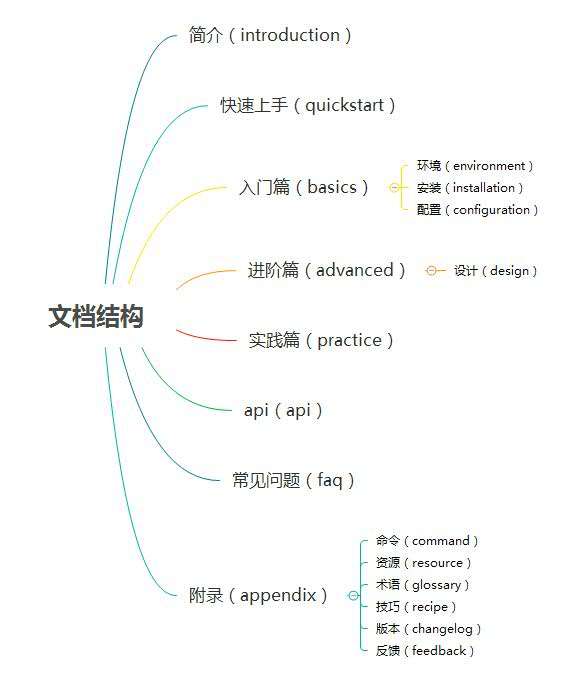

# 文档结构

## 目录结构

软件手册是一部完整的书，建议采用下面的结构。



- **简介**（introduction）： [必备][目录|文件] 提供对产品和文档本身的总体的、扼要的说明
- **快速上手**（quickstart）：[可选][文件] 如何最快速地使用产品
- **入门篇**（basics）： [必备][目录] 又称”使用篇“，提供初级的使用教程
  - **环境准备**（prerequisite）：[必备][文件] 软件使用需要满足的前置条件
  - **安装**（installation）：[可选][文件] 软件的安装方法
  - **配置**（configuration）：[必备][目录|文件] 软件的配置
- **进阶篇**（advanced）：[可选][目录] 又称”开发篇“，提供中高级的开发教程
  - **设计**（design）：[可选][目录|文件] 软件的设计，如：架构、设计思想等
- **实践篇**（practice）：[可选][目录] 提供一些具有实战意义的示例说明
- **api**（api）：[可选][目录|文件] 软件 api 的逐一介绍
- **常见问题**（faq）：[可选][目录|文件] 常见问题解答
- **附录**（appendix）：[可选][目录] 不属于教程本身、但对阅读教程有帮助的内容
  - **资源**（command）：[可选][目录] 命令
  - **资源**（resource）：[必备][文件] 资源
  - **术语**（glossary）：[可选][文件] 名词解释
  - **技巧**（recipe）：[可选][文件] 最佳实践
  - **版本**（changelog）：[可选][文件] 版本说明
  - **反馈**（feedback）：[可选][文件] 反馈方式

下面是两个真实范例，可参考。

- [Redux 手册](http://redux.js.org/index.html)
- [Atom 手册](http://flight-manual.atom.io/)

## 文件名

文档的文件名不得含有空格。

文件名必须使用半角字符，不得使用全角字符。这也意味着，中文不能用于文件名。

```
错误： 名词解释.md

正确： glossary.md
```

文件名建议只使用小写字母，不使用大写字母。

```
错误：TroubleShooting.md

正确：troubleshooting.md 
```

为了醒目，某些说明文件的文件名，可以使用大写字母，比如`README`、`LICENSE`。

文件名包含多个单词时，单词之间建议使用半角的连词线（`-`）分隔。

```
不佳：advanced_usage.md

正确：advanced-usage.md
```
